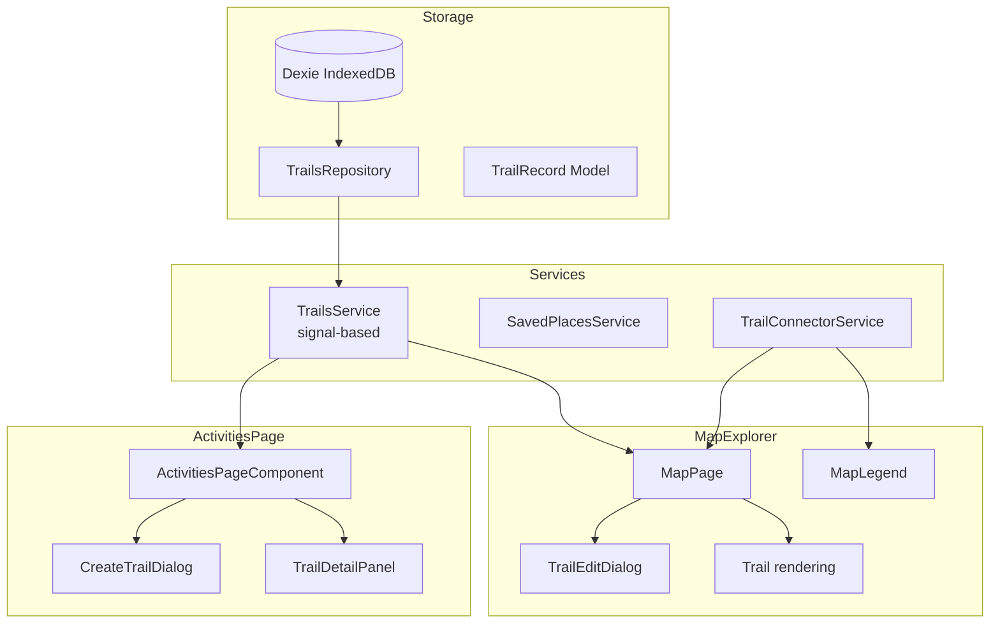

# Trails Implementation Plan: T-130, T-131, T-132

## Overview

Trails is a user-defined collection of activities that represent a single adventure (e.g., a multi-day hike). Activities remain unchanged — Trails are purely an organizational layer stored locally. The implementation spans three phases across the Activities page and Map Explorer.

---

## Phase 1 — T-130: Trails on the Activities Page

### Goal

Enable users to group 2+ activities into a Trail, display Trails as collapsible rows in the activities table, and manage them (rename, delete, add/remove activities).

### Data Layer

#### 1. Add `TrailRecord` model (`src/app/storage/storage.models.ts`)

```ts
export interface TrailRecord {
  id: string;
  name: string;
  description?: string;
  activityIds: string[]; // ordered chronologically
  createdAt: string; // ISO 8601 UTC
  updatedAt: string; // ISO 8601 UTC
}
```

#### 2. Add `trails` table to Dexie (`src/app/storage/db.ts`)

- Bump `DATABASE_SCHEMA_VERSION` from 5 to 6
- Add table: `trails: 'id, createdAt'`
- Add class property: `trails!: Table<TrailRecord, string>`

#### 3. Create `TrailsRepository` (`src/app/storage/repositories/trails.repository.ts`)

- `put(trail)`, `get(id)`, `delete(id)`, `list()`, `count()`, `clear()`
- `updateName(id, name)`
- `addActivityIds(id, newIds)`
- `removeActivityId(id, activityId)` — dissolves trail if only 1 remains
- `findByActivityId(activityId)` — find trail containing an activity

#### 4. Register repository in `TrailroamRepositories` (`src/app/storage/repositories/index.ts`)

- Add `trails: TrailsRepository` to interface
- Add to factory `createRepositories()`

#### 5. Update backup/restore (`src/app/storage/local-data.service.ts`)

- Include `trails` in `TrailroamBackupFile` interface
- Add backup/restore logic for trails

#### 6. Create `TrailsService` (`src/app/storage/trails.service.ts` or shared)

- `load()` — loads all trails into a signal
- Signal: `trails: Signal<TrailRecord[]>`
- `create(name, activityIds)` — validates ≥2, sorts chronologically by activity startDate
- `rename(id, name)`
- `remove(id)` — deletes trail, restores activities as standalone
- `findByActivityId(id)`
- `addToTrail(trailId, activityId)`
- `removeFromTrail(trailId, activityId)`
- `dissolveIfNeeded(trailId)` — auto-dissolve if only 1 activity

### UI Layer — Activities Page

#### 7. Modify `ActivitiesPageComponent` (`src/app/activities/activities-page.component.ts`)

**Inject `TrailsService`**

```ts
protected readonly trailsService = inject(TrailsService);
```

**Core computed signals:**

- `trailMap: Map<string, TrailRecord>` — lookup by trail ID
- `activityToTrailMap: Map<string, string>` — activityId → trailId
- `trailedActivities: Set<string>` — activity IDs that belong to any trail
- `visibleActivities` — filters out `trailedActivities` from the activities list (used for the table rows)
- `visibleRows` — merged list of Trail rows and standalone activity rows, sorted by date
- `expandedTrailIds: Signal<Set<string>>` — session state for expand/collapse
- `filteredVisibleRows` — applies existing filters to both Trails and standalone activities

**Trail filter logic:**

- A Trail is visible if any of its member activities passes the current filters
- When expanded, only matching child activities are shown

**Trail aggregation computed:**

- `trailStats(trailId)` — total distance, total moving time, total elevation, date range, sport types

**Selection:**

- `selectedTrailId` — when set, opens detail panel with aggregated trail data
- Selection of a trail (not expand toggle) opens the detail panel
- Multi-selection of a trail selects all its member activities for bulk actions

**New methods:**

- `onCreateTrail()` — opens create dialog with selected activities
- `onRenameTrail(trail)`
- `onDeleteTrail(trail)`
- `onToggleExpandTrail(trailId)`
- `onSelectTrail(trail)`
- `onRemoveFromTrail(activity, trail)`
- `onAddToTrail(activity)` — shows trail picker dialog
- `navigateToTrailOnMap(trail)`

#### 8. Update template (`src/app/activities/activities-page.component.html`)

**Activities tab view changes:**

- Modify the activities table `*ngFor` to iterate over `visibleRows` (mixed Trail + activity rows)
- **Trail row template** (replaces individual activity rows when collapsed):
  ```
  ┌─ [expand/collapse ▼] 🏔️ Trail Name [Trail badge]
  │   3 activities · 60.2 km · 21–23 Jun  [⋮ menu]
  ```
- **Expanded child rows**: indent existing activity rows under the trail
- **Trail overflow menu**: Rename, Delete, Open on Map
- **Child overflow menu**: Remove from Trail

**Bulk action bar update:**

- Add `[ Create Trail ]` button when ≥2 activities selected
- `[ Download GPX ]` works on selected (trail children selected through trail selection)

**Empty trail state**: trail row with 0 activities doesn't exist (auto-dissolve)

#### 9. Add dialog components

- `CreateTrailDialog` — name input, activity summary
- `RenameTrailDialog` — name input (prefilled)
- `AddToTrailDialog` — trail picker radio list
- Reuse existing `ConfirmDialog` for delete confirmation
- `ConfirmDissolveDialog` — special dialog when removing activity would dissolve a trail

#### 10. Activity detail panel — Trail mode (`src/app/activities/activity-detail-panel.component.ts`)

- Display trail aggregate stats when `selectedTrailId` is set
- List member activities with links
- Actions: Download merged GPX, Show on Map Explorer

### Key Rules for T-130

- Activities continue to exist independently; deleting a trail never deletes activities
- An activity may belong to at most one trail
- Trail rows sort by first activity date
- Expanded state is session-only (not persisted)
- Trails must survive sync, browser restart, and page refresh

---

## Phase 2 — T-131: Trails in Map Explorer

### Goal

Extend Trails to the Map Explorer sidebar and map rendering. Trails appear naturally alongside standalone activities.

### UI Layer — Map Explorer

#### 1. Modify `MapPage` (`src/app/map/map-page.component.ts`)

**Inject `TrailsService`**

```ts
protected readonly trailsService = inject(TrailsService);
```

**Core computed signals:**

- `standaloneRoutes` — routes whose activities are NOT in any trail
- `trailItems` — computed array of Trail objects with aggregated stats
- `mergedSidebarItems` — combines standalone routes + trail items into one sorted list
- `trailRoutes(trailId)` — all routes belonging to a trail
- `selectedTrailId` — set when a trail is selected; cleared when an activity is selected
- `trailToActivityIds(trailId)` — computed set

**Selection state:**

- Only one object selected at a time: an activity OR a trail
- Selecting a trail deselects all activities and vice versa

#### 2. Trail sidebar row (`src/app/map/map-activity-panel.component.ts` — extend or create trail panel)

- Reuse `MapActivityPanelComponent` patterns
- Add a `trails` input and `selectTrail` output, or create `MapTrailPanelComponent`
- Trail row display:
  ```
  🏔️ Trail Name (bold)
  3 activities · 60.2 km · 21–23 Jun
  ```
- Hover highlights all constituent routes on map
- Click selects the trail

#### 3. Trail right-side drawer

- Reuse `ActivityDetailPanelComponent` with a "trail mode"
- Or create a `TrailDetailPanelComponent`
- Display: aggregated stats, member activity list, actions (Download merged GPX, Open in Activities)

#### 4. Map rendering

**`RouteRendererService` (`src/app/map/route-renderer.service.ts`):**

- Add `renderTrail(trailId, routes)` — renders all routes with a single highlight color
- Add `clearTrail()` — removes trail rendering
- Add `fitToTrailBounds(trailId)` — fit bounds across all constituent activities

**`MapLibreMapComponent` (`src/app/map/maplibre-map.component.ts`):**

- Add `selectTrail(trailId, routes)` — highlight all routes, fit bounds
- No new clustering logic needed — trail counts as one item; child activities don't contribute separate cluster markers

#### 5. Search/filter integration

- Searching for "Tatra" matches trail name → shows trail row
- Searching for "Morning" matches child activity → shows parent trail
- Sport filter: trail visible if at least one member activity matches
- Date filter: trail visible if any member activity falls within range

#### 6. Context menu and GPX

- Trail overflow menu: Open in Activities, Rename, Delete
- GPX export: Download merged GPX (concatenated tracks or multi-trkseg)

### Key Rules for T-131

- Activities inside trails must never appear individually in sidebar or on map
- Trails are presevered during sync/refresh
- If referenced activities disappear, remove missing refs; if only 1 remains, dissolve

---

## Phase 3 — T-132: Advanced Trail Visualization

### Goal

Add display mode selector, route interpolation with dashed connectors, drag-and-drop editing.

### Part 1 — Explorer Display Mode

#### 1. Display mode selector (`src/app/map/map-page.component.ts`)

- Add `displayMode: Signal<'activities' | 'trails' | 'hybrid'>`
- Add segmented control near map filters: `[Activities] [Trails] [Hybrid]`
- Persist to localStorage via `SettingsRecord`
- **Activities mode**: current behavior, no trail containers
- **Trails mode**: only trail objects + standalone activities, child activities hidden
- **Hybrid mode**: trails + standalone + child activities visible; trail geometry uses thicker semi-transparent stroke

### Part 2 — Route Interpolation

#### 2. Connector service (`src/app/map/trail-connector.service.ts`)

- `computeConnectors(trailId, routes)` — generates connector geometry between consecutive activities
- Connector styling: dashed, lower opacity, thinner stroke
- Tooltip: "Connection — No GPS recording exists between these activities."
- Smart connector types:
  - Start/end within 500m: no connector
  - 500m–5km: straight dashed connector
  - Over 5km: connector with endpoint markers
  - Over 25km: no connector (disconnected)

#### 3. Connector toggle

- Map control: `☑ Show estimated connections`
- Default: enabled
- Persist preference locally

### Part 3 — Trail Edit Drawer

#### 4. `TrailEditDialog` or inline drawer

- Drag-and-drop reordering of activities
- Add activity via drag from sidebar
- Remove activity via drag outside or button
- Preview changes on map immediately
- Save/Cancel

#### 5. Drag source for standalone activities

- Modify sidebar rows to be draggable when a trail edit is active
- Drop zone on trail name

### Part 4 — GPX Export Options

#### 6. Update `GpxExportService` (`src/app/shared/gpx-export.service.ts`)

- Multi-segment GPX (default)
- Flatten into one track (option)
- Include visual connectors as estimated track segments (option)

### Part 5 — Visual Legend

#### 7. Map legend component

- `━━ Recorded GPS` (solid line)
- `- - - Estimated connection` (dashed line)
- Automatically hidden when connectors are disabled

### Key Rules for T-132

- User preference persists locally
- Connectors must never look like recorded GPS data
- Drag-and-drop updates `activityIds[]` immediately after confirmation
- Crossing oceans (>25km): don't draw connectors
- Memoize merged geometries, connector geometries, trail bounds

---

## Database Schema Upgrade

| Version     | Change             |
| ----------- | ------------------ |
| 5 (current) | saved_places table |
| 6           | trails table       |

## Files to Create

| File                                                  | Purpose                            |
| ----------------------------------------------------- | ---------------------------------- |
| `src/app/storage/repositories/trails.repository.ts`   | CRUD for trails                    |
| `src/app/storage/trails.service.ts`                   | Orchestration service with signals |
| `src/app/activities/create-trail-dialog.component.ts` | Create trail dialog                |
| `src/app/activities/trail-detail-panel.component.ts`  | Detail panel for a trail           |
| `src/app/map/trail-connector.service.ts`              | Route interpolation logic          |
| `src/app/shared/trail-edit-dialog.component.ts`       | Drag-and-drop trail editor         |
| `src/app/map/map-legend.component.ts`                 | Visual legend component            |

## Files to Modify

| File                                                    | Changes                                 |
| ------------------------------------------------------- | --------------------------------------- |
| `src/app/storage/storage.models.ts`                     | Add `TrailRecord` interface             |
| `src/app/storage/db.ts`                                 | Bump schema version, add `trails` table |
| `src/app/storage/repositories/index.ts`                 | Register `TrailsRepository`             |
| `src/app/storage/repositories/repositories.token.ts`    | No changes needed (auto-wired)          |
| `src/app/storage/local-data.service.ts`                 | Trail backup/restore                    |
| `src/app/activities/activities-page.component.ts`       | Trail integration                       |
| `src/app/activities/activities-page.component.html`     | Trail rows in table                     |
| `src/app/activities/activities-page.component.scss`     | Trail row styles                        |
| `src/app/activities/activity-detail-panel.component.ts` | Trail mode                              |
| `src/app/map/map-page.component.ts`                     | Trail sidebar + rendering               |
| `src/app/map/map-page.component.html`                   | Trail panel + legend                    |
| `src/app/map/mock-routes.ts`                            | Add trail type to routes if needed      |
| `src/app/map/route-renderer.service.ts`                 | Trail rendering method                  |
| `src/app/map/maplibre-map.component.ts`                 | Trail selection/rendering               |
| `src/app/shared/gpx-export.service.ts`                  | Merged GPX export                       |

## Implementation Order

1. **T-130 Steps 1-6**: Data layer (model, DB, repository, service)
2. **T-130 Steps 7-10**: Activities page UI (trail rows, dialogs, detail panel)
3. **T-131 Steps 1-3**: Map sidebar integration
4. **T-131 Steps 4-6**: Map rendering, filters, context menu
5. **T-132 Part 1**: Display mode selector
6. **T-132 Part 2**: Route interpolation
7. **T-132 Parts 3-5**: Edit drawer, GPX options, legend

## Testing Strategy

### Unit Tests

- `TrailsRepository` — CRUD, findByActivityId, dissolve logic
- `TrailsService` — create validation, add/remove, duplicate membership
- `TrailConnectorService` — connector generation, distance thresholds
- `GpxExportService` — merged trail GPX output

### Component Tests

- Trail row rendering, expand/collapse
- Create trail dialog validation
- Display mode switching

### E2E Tests

- Create trail from selected activities
- Expand/collapse trail in activities table
- Delete trail restores activities
- Trail appears in Map Explorer sidebar
- Trail rendering on map
- Display mode switching in Map Explorer

## Architectural Diagram



---

## Dependencies and Risks

- **No dependencies** on T-127/T-128/T-129 (Saved Places). Trails is independent.
- **Risk**: Performance with 5,000+ activities. Mitigation: memoize aggregated stats, avoid recomputation during pan/zoom.
- **Risk**: Complexity of drag-and-drop. Mitigation: start with simple reorder (no drag-and-drop), add in Phase 3.
- **Risk**: Sync removing referenced activities. Mitigation: dissolve logic runs on `TrailsService.load()`.
